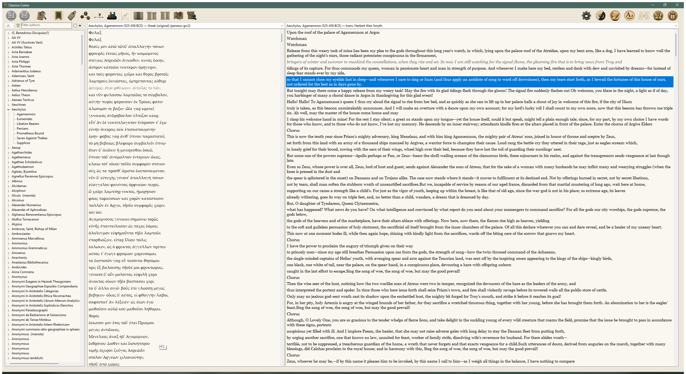
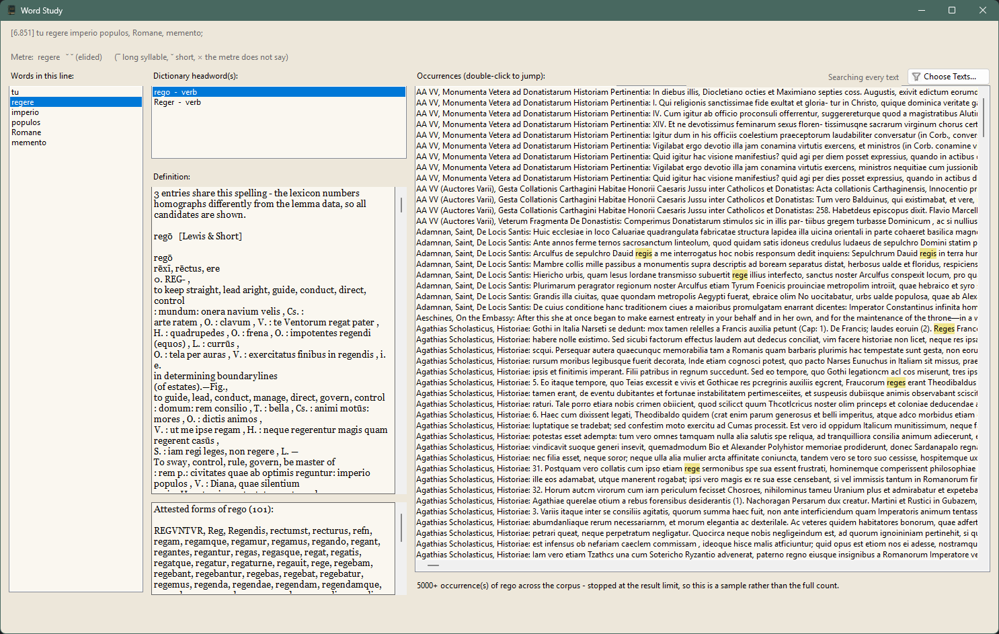
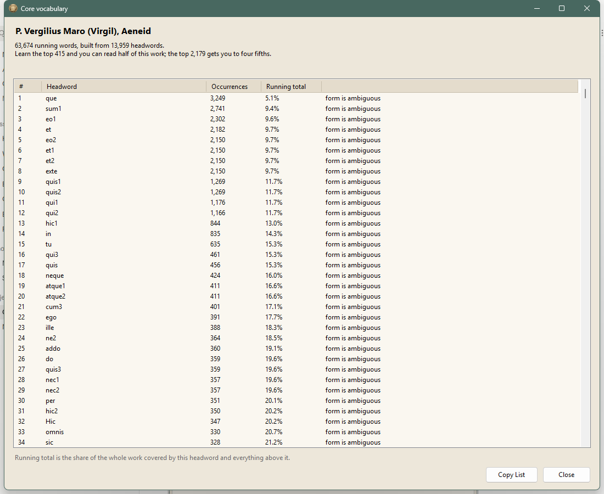
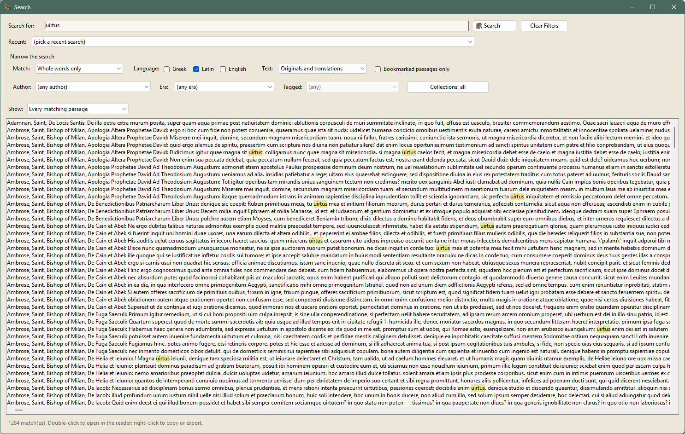
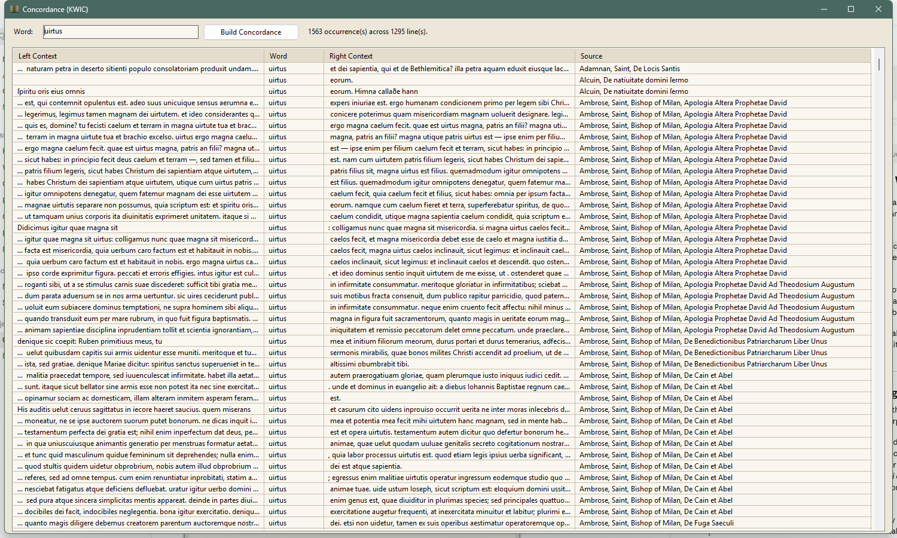
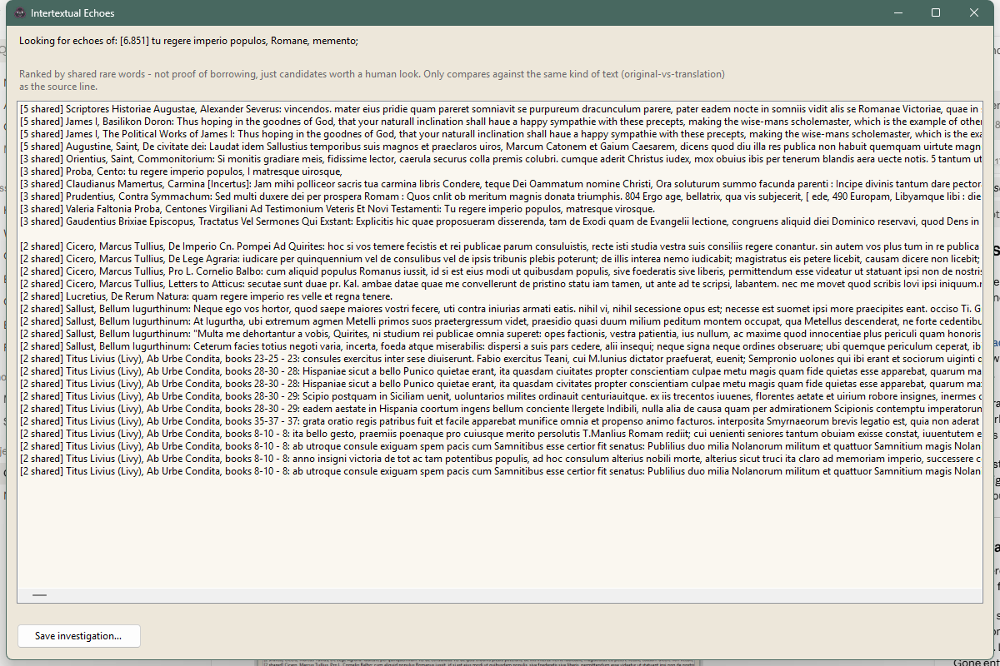

# Classica Codex

A desktop reader and research tool for the [Perseus Digital Library](http://www.perseus.tufts.edu/) — the Greek and Latin classics (plus optional Post-Classical Greek and the Renaissance authors who reworked the classics in English), their translations, dictionaries, and the linguistic data that makes searching them work properly. Also, Menota documents can be manually added. This is new and still a bit experimental.

Everything is fetched once and kept in a database on your own machine, so after
setup it runs entirely offline — no tab, no network, no waiting on a server. The
classical core is 159 authors and 1,221 works; with every optional collection
installed it comes to 748 authors, 4,021 works and around 2.3 million lines,
with 423,000 dictionary entries and a million inflected forms alongside them.

Built as a personal project, for reading and researching the classics more closely than a browser tab really allows.

Why make it a Windows Forms application? 
This was just my personal preference for development. 
If there is interest from Mac users then let me know and I can attempt to make a version for the Mac as well.

## Download

The latest Windows release is on the
[Releases page](https://github.com/ClassicaCodex/ClassicaCodex/releases/latest).
Extract it, run `ClassicaCodex.UI.exe`, and the setup wizard does the rest — see
[Getting started](#getting-started) for what to expect, including the Windows
security warning you'll hit on first run.

## Read the original beside the translation

Both panes scroll together, which suits verse; switch the linking off for prose,
where the line counts diverge and the mirroring starts fighting you. The library
tree on the left is every author you've installed. It reopens on the passage you
were last reading.

## Click a word and get the answer, not a search box

The thing that actually slows reading down is meeting a word and not being sure
what part of speech it is or what headword to look up. Right-click any line for
this: the words in it, the dictionary headwords the form could belong to,
the full Lewis & Short or LSJ entry, every attested form of the word, and every
other place it occurs in the library.

Where a form is genuinely ambiguous it says so and shows all the candidates,
rather than picking one and being quietly wrong. For Latin verse it also scans
the line and marks the syllables the metre settles.

## Know what vocabulary a work actually needs

Every headword in a work, ranked by how much of the text it accounts for, with a
running total — so you can see that the top 415 words get you through half the
*Aeneid* and the top 2,179 get you to four fifths. Counted from the text in
front of you rather than from a general frequency list, and honest about the
share it cannot cover: a form that could belong to more than one headword is
marked, because its count is an upper bound.

## Search the whole library at once

By word or phrase, narrowed by author, language, era, collection, or your own
tags. The default whole-word search matches past the spelling as well as the
word: accents and breathings, all three shapes of sigma, and both halves of
Latin u/v and i/j — so an unaccented Greek word finds the accented form, and
`iustitia` finds the editions that print `justitia` too. Counts are of the
whole library rather than of the page, so "how often, and where" is a question
it can actually answer. Results export, and the last ten searches are kept with
all their filters.

## Concordance

Every occurrence of a word in its context, aligned down the middle — the printed
concordance's one genuinely irreplaceable trick, which is that you can read down
the column and see the shape of a word's use. The keyword column shows the word
as each edition prints it, so searching `uirtus` lines up `virtus`, `uirtus` and
`Virtus` together rather than making you pick one.

## Find where a line is reused

Give it a passage and it ranks the rest of the library by shared rare words.
Not proof of borrowing — candidates worth a human look, and it says so on the
window. Asked about *Aeneid* 6.851 it turns up Proba's *Cento Vergilianus*
rebuilding the line almost verbatim, along with Lucretius, Cicero and Livy.

There is a cross-language version of the same idea, for finding where a Latin or
English passage is reworking a Greek original, and a Reception Tracker that
sorts the hits by whether their author came before or after.

## And the rest

Timeline, stylometry, myth networks, a translation workbench, dark mode

**Timeline** — the authors across time; click one to see what they wrote.

**Stylometric analysis** — authorial fingerprints with Burrows's Delta, saved
runs and batch comparison. Built as a hobby, with a
[long note on what it can and cannot tell you](#notes-on-the-stylometry-tool);
if it's useful to your research I'd like to hear about it.

**Myth Network** — a graph of which figures and places co-occur, built from your
own tags as you read rather than from a fixed dataset. Good for finding rabbit
holes, and for writers as much as researchers.

**Translate it yourself** — a workbench for working through a text a passage at
a time, with the passages either side for context and every word clickable. AI
help sits beside your work rather than in it, and the published translation
stays out of reach until you've written something.

**Dark mode**, with a parchment light theme and separate artwork for each.

## Features

- **Read** the original alongside a translation, for any work in the Perseus corpus
- **Search that reads past the spelling** — accents and breathings, all three shapes of sigma, and both halves of Latin u/v and i/j, so one query reaches every edition's way of printing a word. For every *inflected form* of a headword, Word Study asks the lemma data
- **Morphology search** — find every line matching a specific grammatical form (case, tense, mood, voice…), not just a specific word
- **Tag** people, places, and themes across every author at once, and browse everything tagged with a given name (with **Auto-Tag** to suggest matches for a name automatically), and **bookmark** individual lines with your own notes
- **Myth Network** — a graph of which figures and places co-occur, built from your own tags as you read, not a fixed dataset
- **Places Map** — an actual map of the ancient world, 200 places filterable by kind; click one to see every passage that mentions it
- **Word Study** — dictionary definitions (LSJ for Greek, Lewis & Short for Latin) and every attested form of a word
- **Core Vocabulary** — every headword in a work ranked by how much of the text it accounts for, with a running total: learn the top N and you can read half of it. Counted from the text itself, and honest about the share it can't cover
- **Where should I start?** — a short curated list of works that are reasonable to translate first, filtered to what's in your library, and a plain warning about the ones that aren't
- **Timeline** of authors and works across time
- **Stylometry** — authorial "fingerprints" using Burrows's Delta, with saved runs and batch comparison across an author's whole output
- **Validation bench** — leave-one-out validation, a parameter-stability grid, and controlled perturbation with synthetic contamination and same-author controls. Reports how much contamination the method could detect at all, which is what a null result needs to mean anything. Experiments save with their seed and pool; every table exports to CSV, text or Excel. See [Notes on Burrows's Delta](docs/stylometry-notes.md) for what it can and cannot tell you
- **Concordance** (KWIC) search across the whole library
- **Echo Finder** and **Reception Tracker** — find intertextual echoes, and track how a passage gets reused by later authors
- **Cross-Language Echo** — the same idea across languages, for finding where a Latin (or English) passage is reworking a Greek original, or vice versa
- **Compare** two passages, or two translations of the same work, side by side
- **Translate it yourself** — a workbench for working through a text one passage at a time, with the passage before and after shown for context, every word clickable for its dictionary headword, grammatical parse and LSJ or Lewis & Short entry, and an alphabet reference for a script you don't read yet. Your translation becomes an edition like any other. AI help is available per word or per passage, but always appears beside your work rather than in it, and the published translation stays out of reach until you've written something
- **AI-assisted translation** — translate a single passage on demand, or an entire work at once, using Claude or Gemini. Off by default and opt-in per use — nothing is sent anywhere unless you ask for it, and the app works completely offline without it
- **Read Aloud** — text-to-speech for Greek, Latin, or English, using whatever voices are already installed on Windows; fully offline, no network involved
- **Export** passages to plain text, Word, or PDF, citations intact — and every translation carries the edition it came from, so a published rendering, your own, and an AI's are never confused once the text has left the app
- **Latin Church Fathers (CSEL)** — the critical editions of Augustine, Ambrose, Jerome, Cyprian and their contemporaries, from the volumes old enough to be out of copyright
- **Patrologia Latina** — Migne's collection of Latin Christian writing, Tertullian to the twelfth century, and much the largest thing the app can install. A 19th-century reprint rather than a critical edition, and the setup step says so: where a work appears in both, CSEL is the text a scholar cites and this is the wider net. Both sit side by side, the same work gaining a second edition rather than being overwritten
- **Political theory** — Bodin's *Six Books of the Commonwealth* in the French of 1577, the Latin of 1586 he made himself, and Knolles's English of 1606. One work rather than a corpus, and the rare case where an author's own translation of his own book can be read against the original
- **Search or browse one collection at a time** — with several collections installed, "search only the Church Fathers" is a question the language filter cannot answer, since they and the classical Latin texts are both Latin. Both the search window and the library tree narrow to any number of collections, and the tree filters works as well as authors, so an author in two collections shows only the works you asked for
- **Collate two editions of one work** — where the library holds a text twice, whether from two collections or two editions in one, see what the editors disagreed about. Differences are graded rather than counted: punctuation, spelling, line division, and — the only one that is a reading — the words. Measured against a full library, about a fifth of the shared lines in the Aeschylus pairings differ in the words and the rest is typography, which is exactly why an ungraded diff would be useless. Exports to CSV, text or Excel with both editions, the counts and any caution written above the table
- **Marks in the margin of the line** — a `?`, `#` or `★` at the end of a passage says an inquiry has been started from it, that it carries a tag, or that it is bookmarked. Drawn rather than stored, so copying or exporting the line still gives you only the text
- **A default collection** — overlap between collections is normal: Perseus and First1KGreek both carry the Agamemnon, CSEL and Patrologia Latina share a good deal of Augustine. Pick which one a work opens on and it applies everywhere, rather than the choice falling to whichever edition happens to sort first. A preference and not a filter — the other editions stay in the dropdown, only the selection changes
- **Results by document** — switch the search between every matching passage and one row per work with its match count, for when the question is where a word is concentrated rather than what each occurrence says
- **Recent searches** — the last ten searches you ran, with every filter, recorded automatically; nothing to save and nothing to tidy up
- **Favorites** — star the works you actually return to and filter the library to them; stored against the work's CTS URN, so they survive a corpus re-ingest
- **Back and Forward** — retrace where you've been. Ten features here end in "jump to it"; following a reference no longer costs you your place
- **Keyboard shortcuts** — Escape closes any window you're looking at, Ctrl+F searches, Alt+Left and Alt+Right navigate; the workbench saves and advances on Ctrl+Enter
- **Adjustable text size** — Greek, Latin and English, linked by default. Polytonic diacritics are what you need to see to look a word up, and they're a few pixels each at a small size
- **Linked panes, or not** — original and translation scroll together by default, which suits verse; switch it off for prose, where line counts diverge and the mirroring starts fighting you
- **Picks up where you left off** — reopens the passage you were last reading, and can be turned off if you'd rather it didn't
- **Medieval Nordic manuscripts** — Old Norse, Icelandic, Swedish and Danish texts from the [Medieval Nordic Text Archive](https://www.menota.org), transcribed word by word from the parchment rather than edited into a printed text: Heimskringla, Laxdœla saga, the Codex Wormianus, the Old Norwegian homily book, Vǫluspá in the Codex Regius. A manuscript is a physical object containing whatever was bound into it, so the import shows you what it found in each file and lets you merge, split, retitle or drop works before anything is written
- **Editor's Notes** — the apparatus of those manuscripts, kept beside the text rather than read as part of it. Manuscript variants carry the adopted reading, the alternative and the witness it came from; editorial notes carry ligatures, scribal corrections, worn passages and missing leaves. A variant collated from another manuscript is not a word of this one, and reading the two together would quietly corrupt every word count and frequency measure built on the text
- **Dark mode**, with a parchment light theme, and separate artwork for each

## Getting started

Download the ZIP from [Releases](https://github.com/ClassicaCodex/ClassicaCodex/releases/latest), extract all of it, and run `ClassicaCodex.UI.exe`. Nothing to install, and no developer tools needed.

Windows will almost certainly stop you the first time with a blue "Windows protected your PC" box. That's SmartScreen, and it appears because the app isn't code-signed — a certificate costs a few hundred dollars a year, which isn't something a free personal project carries. Click **More info**, then **Run anyway**. Windows remembers, and won't ask again.

Extract the whole archive before running it, not just the `.exe`. Running it from inside the ZIP, or copying the executable out on its own, leaves its libraries behind and it won't start.

On first launch, a setup wizard walks you through everything else — it'll ask which of two ways you'd like to do that:

- **Guided Setup** (default on first run) — one step at a time, plain language, no file paths or repository URLs on screen
- **Advanced Setup** — every data source on one screen, for pointing at files you've already downloaded or wanting more control over where things go

Take what you want and skip the rest; anything skipped can be added later. With
everything selected, including the word index that makes searching fast, it runs
about an hour — but it's unattended, so start it and go and do something else.

### What to expect the first time

**Full Setup takes about an hour**, most of it unattended and you can skip what you don't want and it's faster. The wizard downloads several corpora, parses them, ingests them into SQLite, and then builds the word index that makes search fast. On a clean Windows machine with a decent connection that came to roughly an hour end to end; a slower link will take longer. The Greek and Latin Lemma data and Word Indexing for faster searching takes the longest time.

It is probably not stuck. Progress is reported at each stage, but individual stages — ingestion especially — can sit on one line for several minutes at a time. Leave it running until you get resolution.

The first step is the database — where your library, tags, and bookmarks will live. Everything after that (the texts, dictionaries, lemma data, map data, and the word index that makes search fast) can be done in whatever order suits. Any step can be skipped and picked up later from the same wizard, so there's no need to do it all in one sitting.

The Medieval Nordic manuscripts are the one source the wizard can't fetch for you: Menota publishes one XML file per manuscript through a catalogue rather than as an archive, so that step opens the catalogue and points at a folder for you to save into. Skipping it costs you nothing else.

## Data sources & licensing

Classica Codex doesn't own or bundle any of the texts, dictionaries, or linguistic data it reads — none of it ships in this repository. All of it is fetched by the setup wizard from the following open projects, each under its own license:

| Source | Provides | License |
|---|---|---|
| [PerseusDL/canonical-greekLit](https://github.com/PerseusDL/canonical-greekLit) & [canonical-latinLit](https://github.com/PerseusDL/canonical-latinLit) | The Greek and Latin texts themselves | CC BY-SA 4.0 |
| [PerseusDL/lexica](https://github.com/PerseusDL/lexica) | LSJ (Greek) and Lewis & Short (Latin) dictionaries | CC BY-SA 4.0 |
| [gcelano/LemmatizedAncientGreekXML](https://github.com/gcelano/LemmatizedAncientGreekXML) | Greek word-form → headword mapping | **CC BY-NC 4.0** |
| [lascivaroma/latin-lemmatized-texts](https://github.com/lascivaroma/latin-lemmatized-texts) | Latin word-form → headword mapping | CC BY-SA 4.0 |
| [Natural Earth](https://www.naturalearthdata.com/) (`ne_110m_land.geojson`) | Coastline for the Places Map | Public domain |
| [perseus-aa/json](https://github.com/perseus-aa/json) | Art & Archaeology catalog data (vases, coins, sites…) for the Places Map and Myth Network | Perseus terms; catalog only — images are always loaded live from Perseus, never downloaded |
| [Princeton WordNet](https://wordnet.princeton.edu) | English word-form → headword mapping and definitions, for search and Word Study on translations | WordNet License (permissive, free for any use) |
| [PerseusDL/canonical-engLit](https://github.com/PerseusDL/canonical-engLit) | Renaissance & Early Modern English texts — Shakespeare, Holinshed, Hakluyt, Sidney, James I — optional. Perseus splits this collection into freely redistributable texts and ones that aren't, and only the first are imported; see [What Marlowe isn't here](#what-marlowe-isnt-here) | CC BY-SA 4.0 |
| [OpenGreekAndLatin/First1KGreek](https://github.com/OpenGreekAndLatin/First1KGreek) | Post-Classical Greek texts extending the corpus into late antiquity, optional | CC BY-SA 4.0 |
| [OpenGreekAndLatin/csel-dev](https://github.com/OpenGreekAndLatin/csel-dev) | Corpus Scriptorum Ecclesiasticorum Latinorum — critical editions of the Latin Church Fathers, optional | CC BY-SA 4.0, declared per file in the TEI headers rather than at the repository root |
| [OpenGreekAndLatin/patrologia_latina-dev](https://github.com/OpenGreekAndLatin/patrologia_latina-dev) | Migne's Patrologia Latina — Latin Christian writing to the twelfth century, optional. A reprint rather than a critical edition; most of it is still under provisional reference numbers the publishing project intends to replace | CC BY-SA 4.0, declared per file |
| [PerseusDL/canonical-pdlpsci](https://github.com/PerseusDL/canonical-pdlpsci) | Jean Bodin's *Six Books of the Commonwealth* in French, Latin and English, optional | CC BY-SA 4.0 |
| [Medieval Nordic Text Archive](https://www.menota.org) | Old Norse, Icelandic, Swedish and Danish manuscript transcriptions, optional — downloaded individually from Menota's catalogue, one file per manuscript, since there's no archive to fetch | CC BY-SA 4.0 |

The Greek lemma data is the one entry above marked **noncommercial** — it can't be sold, and because it's woven into the search and Word Study features, that restriction carries over to the whole project as distributed. Which is fine: Classica Codex is a free personal tool, and it's going to stay that way regardless. (WordNet's license, despite doing a similar job for English, doesn't carry the same restriction — it's permissive and doesn't add a second constraint on top of the Greek lemma data's.)

The AI-assisted translation feature is a separate case from all of the above: it isn't a bundled dataset at all, just an optional connection to a third-party API (Anthropic's Claude or Google's Gemini) that you provide your own key for. Nothing about it is required to use the app, and nothing is sent anywhere unless you explicitly ask for a translation.

### What Marlowe isn't here

The Renaissance collection is the one place where what you get is noticeably less than the repository contains, and it's worth saying plainly rather than letting you find out by looking for *Doctor Faustus*.

Perseus divides that collection into texts that can be redistributed freely and texts that can't — the New Variorum Shakespeare and other 19th and 20th-century scholarly editions still in copyright. The split is marked in the folder layout, and Classica Codex imports only the first kind. Of 96 files, 66 are imported and 30 are not.

**Every one of Marlowe's own works is on the wrong side of that line.** All sixteen files — *Tamburlaine* both parts, *Doctor Faustus* in both the A and B texts, *Edward II*, *The Jew of Malta*, *Dido*, *The Massacre at Paris*, *Hero and Leander*, the Ovid and Lucan translations, *The Passionate Shepherd* — are in the restricted half. None of them are imported, and no setting will import them.

One Marlowe file is freely licensed, and it isn't by Marlowe: the *Faust Book*, the anonymous English translation of the German *Historia von D. Johann Fausten* that he used as his source for *Doctor Faustus*. Perseus files it under his name because that's what it's a source for, and the import follows Perseus's filing, so the library lists it under Christopher Marlowe. It's a genuine text and worth reading next to the play — but the play isn't here, and the attribution is Perseus's rather than a claim about who wrote it.

Shakespeare, Holinshed, Hakluyt, Sidney, James I, Wilson and Peacham are all imported in full; Shakespeare alone is 43 works. What's missing is Marlowe.

## Platform

Windows only, for now — it's built on WinForms, which doesn't run elsewhere. No Mac or Linux build exists.

### Building from source

Not necessary to use the app — the release ZIP is self-contained. If you want to build it anyway, you'll need the [.NET 8 SDK](https://dotnet.microsoft.com/download/dotnet/8.0). Clone the repo and either open `ClassicaCodex.sln` in Visual Studio 2022 or later, or run `dotnet build` from the command line. Everything after that is the same setup wizard.

## License

The code in this repository is [MIT licensed](LICENSE). That covers the application itself, not the data it downloads at setup — see [Data sources & licensing](#data-sources--licensing) above for those.

## Notes on the stylometry tool

The stylometry feature was built to work on a real disputed-authorship question
— the *Rhesus* transmitted under Euripides' name — and the write-up of what came
of that is in [docs/stylometry-notes.md](docs/stylometry-notes.md).

The short version, because it matters for anyone using the feature:

- It surfaced four genuine corpus bugs, now fixed. The largest: the TEI parser
  was ingesting critical apparatus as running text, so editors' surnames and
  manuscript sigla were being counted as Greek vocabulary. About 17,000
  characters of First1KGreek's *Agamemnon* were apparatus — and Perseus files
  carry the same material as inline notes.
- **Depth to first outsider does not work as an attribution measure.** It varied
  by up to 20 ranks for a single work on a 500-token change in sample size. It
  is a rank position, and rank positions track text length however you correct
  for them.
- **Delta floor is more robust** and shows no length effect, but the one
  promising result it produced failed to replicate at a different sample size.
- It did not answer the authorship question, and the write-up says so.

Delta measures similarity of word-frequency profile. On a same-genre corpus that
comes apart from authorship more than is comfortable. The tool includes a
stability comparison and a length-confound test because both are needed before
any ranking should be believed, and a validation bench because those two were
not enough — four separate measures turned out to be reading text length or
baseline margin rather than style, each caught by checking rather than by
suspecting.

## Status

Version 3.6.2.

Version 1 was a reader. Version 2 made it a searchable, taggable,
cross-referenced library and added the translation workbench. Version 3 adds the
Medieval Nordic manuscript reader and its editorial apparatus — a different kind
of text from the printed editions the rest of the library holds, and the first
material here where the manuscript evidence is visible rather than settled.

3.4.0 came out of an audit rather than a plan, and its largest finding is that
a good deal of the Latin corpus was never being ingested. Perseus catalogues
each folder in a file naming what is inside it; 65 of `canonical-latinLit`'s 399
work folders and six of its author folders carry no such file, and the ingest
passed over them without recording anything. 197 edition files went nowhere
while setup reported success — Bede's *Historia ecclesiastica*, Cato's *De agri
cultura*, Apicius, Sidonius, Augustine's letters, the whole Appendix Vergiliana,
Petronius' fragments, Livy's *Periochae* and four of the six Livy editions
Perseus carries. The Greek corpus catalogues everything, which is why this took
a while to notice. A folder without a catalogue is now rebuilt from the files in
it, and the Latin corpus ingests 687 of 687. **If you have a Latin library,
re-run that setup step.**

A second route to the same hole, found separately: each setup step decided
whether it had already run by asking whether the library held any author in its
namespace, and a namespace is shared. Once CSEL and the Patrologia Latina
existed, installing either one answered for classical Latin, the step was
skipped, and Virgil never arrived. Steps now ask about their own collection.

The same audit found the *Satyricon* missing a fifth of its prose — Petronius
quotes verse inside his narrative, and the parser took the poems and dropped
what surrounded them — and 1,679 editor's notes keyed to citations no passage
answered to. Both are fixed and both were measured, before and after, against
the corpus rather than against a test case. The word index also stopped storing
itself twice, which takes a finished install from about 1.7 GB to 1.1 GB, and
the hexameter scanner reached the surface: Word Study now says what the metre
makes of the word you picked, which for Latin is the only thing that can, since
no edition prints the vowel lengths that tell a nominative from an ablative.

3.3.0 spends what 3.2.0 bought. Holding seven collections means holding some
works twice, and two independent printings of one text are the raw material of a
collation — so the app now compares them and says where their editors disagreed.
The whole difficulty is that a byte-for-byte comparison calls almost every line
different, which is worse than no comparison because it looks like evidence. So
differences are graded: punctuation, spelling, line division, and — the only one
that is a reading — the words. Measured across this library that is the
difference between "58% of lines differ" and "19% do", and the 19% are real
variants. Every collation exports to CSV, text or Excel with its counts and its
cautions attached.

3.3.1 extends that to the rest of the result screens. Twelve of them could
already export their passages as prose — plain text, Word, PDF, for quoting —
and four could export a table. The two had never been laid over each other, so
bookmarks could be written as a document but not as rows, and the stylometry
screen that produces the actual result could not be exported at all, though
every bench built to check that result could.

3.2.0 takes the library from three collections to seven — CSEL, the Patrologia
Latina, and Bodin — and then deals with the consequence of that, which is that
collections overlap. Two of them can hold the same work, and once that is true
the app has to answer questions it never had to before: which collection am I
searching, which one does this work open on, which collection is this passage
even from. Search, the library tree and the recent-search list all narrow by
collection now, and a default collection settles which edition opens.

The overlap also exposed a text the reader could not show at all. First1KGreek
carries the notes published alongside the Septuagint Isaiah as a separate
edition, and a gap in how CTS version identifiers were read left it classified
as neither original nor translation — so it was ingested, indexed, returned by
searches, and impossible to open. Three thousand lines you could read in a
results list and nowhere else.

3.1.0 adds a validation bench for the stylometry: leave-one-out validation, a
parameter-stability grid, and controlled perturbation with synthetic
contamination. It exists because the stylometry was producing results faster
than it could check them, and everything it has produced since has been
negative. Five candidate findings dissolved under it; the sixth is a bound on
the method itself — on this corpus Burrows's Delta cannot reliably detect a
second hand contributing less than about a third of a play. A null result is
worth little without that number, so the bench now computes it on every sweep.

A positive control decides whether that null is about the method or about the
bench: Plato against Homer separates at AUC 0.94, so the instrument works and
the tragic result is a fact about Greek tragedy. It also caught a bug that made
the method look weaker than it is — the hardest kind to notice in a project
whose every result so far had been negative.

The contamination is synthetic and drawn from a whole corpus, which is an
idealised donor rather than a real interpolation. That was recorded as an
unquantified caveat and is now measured: drawing each mixture from a single
donor work leaves the mean effect the same and raises the variance 1.43 times,
moving detection from AUC 0.76 to 0.74. The idealisation buys precision, not
power. Both modes are on the form.

Experiments save to the library with their seed, exact pool and settings, and
reload complete enough to re-run. Any results table right-clicks to CSV,
tab-separated text or Excel, at full precision and with the settings in the
header.

The places map grew from 100 places to 200 — the second hundred harvested from
the Getty records Perseus embeds in its English Herodotus — and gained a kind
per place: cities, sanctuaries, battlefields, regions and islands, rivers and
seas, each with its own pin colour and each switchable off. Two hundred names
at Mediterranean scale is more than can be read at once, so labels are now
placed only where they fit, in order of how often you have tagged the place.
Every pin still draws: the pin is what you click.

Submenus are themed properly for the first time. The theme walk stopped at the
top level of a context menu, so every submenu in the app kept the system
default — dark ink on a dark surface, invisible in dark mode and findable only
by knowing it was there.

Three older bugs surfaced while testing all this: saved searches were missing
from databases created fresh rather than upgraded, a schema-initialisation path
no test covered, and two copies of the place catalog resolving differently per
project. All fixed, and there is now a test that asks SQLite what a new database
actually contains rather than trusting a list.

3.0.1 was a corpus-accuracy release. Speech attributions were being dropped from
every play in the library — 42,448 of them in the Greek alone, and every Terence
comedy and Shakespeare play besides — along with list entries, colophons and the
Greek Anthology's poet attributions. Plato's attributions had the opposite
problem: they were being counted as vocabulary, so Gorgias read as 4.1% "ΣΩ." by
word count. Text nodes now record what kind of thing they are, which lets the
reader show a play's speakers while the word counts and the stylometry ignore
them.

Re-ingesting is what applies this to an existing library — the text that was
dropped was never stored, so a migration cannot recover it. Citation references
are unchanged, so annotations, bookmarks and tags survive re-ingesting intact.

The schema has moved through thirty-seven migrations. Existing databases upgrade in
place on first launch — annotations, bookmarks and tags are carried forward.

## Questions, ideas, and things that break

- **[Discussions](https://github.com/ClassicaCodex/ClassicaCodex/discussions)** —
  questions about using it, and anything you want it to do that it doesn't.
  **[Ideas](https://github.com/ClassicaCodex/ClassicaCodex/discussions/categories/ideas)**
  is the right category for a feature you'd like; if you work with a corpus this
  doesn't carry yet, say so there.
- **[Issues](https://github.com/ClassicaCodex/ClassicaCodex/issues)** — something
  broken. The version, what you were doing, and what you expected instead is
  plenty; a screenshot helps if it's visual.

One person maintains this, so answers won't always be quick, but everything gets
read. Reports about the corpus are especially welcome — if a text you know well
looks wrong, truncated, or missing, that is worth telling me about, because it is
exactly the kind of thing that hides in a library this size.

Built for my own reading, and shared in case it's useful to someone else doing
the same thing.

